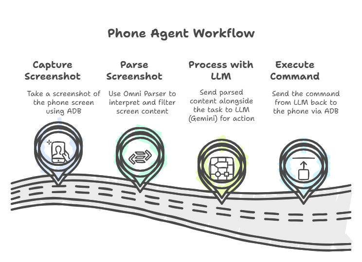
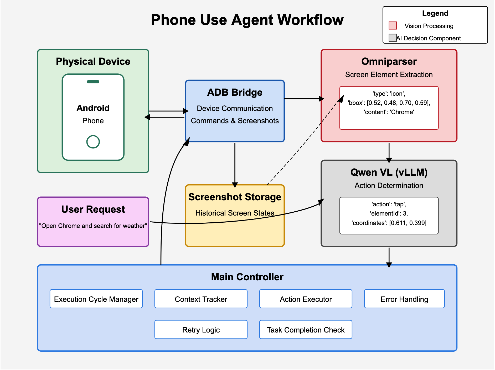

# Phone Use Agent for Winodws

An experimental Python agent that controls Android phones using ~~Qwen2.5-VL~~ Gemini 2.0 Flash, OmniParser, and ADB.
I left the Qwen2.5 VL code in, theoritically it should work on windows with my modifications, but i could not test it, since i dont have a good GPU, hence i replaced it with Gemini 2.0 Flash.





## Overview

The Phone Use Agent automates interactions with Android devices by:
- Taking screenshots via ADB
- Analyzing UI elements with OmniParser
- Making decisions with ~~Qwen2.5-VL vision language model through vLLM~~ Gemini 2.0 Flash 
- Executing actions (tap, swipe, type) through ADB

## Requirements

- Python 3.10
- Windows 10/11 operating system
- Android Debug Bridge (ADB)
- CUDA-capable GPU (Tested on 3xxx GPU with Cuda 12.4) (Preffered for Omni Parser)
- Connected Android device with USB debugging enabled

## Installing ADB

### On Windows:
1. Download adb from [SDK Platform-Tools for Windows](https://developer.android.com/tools/releases/platform-tools)
2. Add the platform-tools to your PATH:
   - Open System Properties > Advanced > Environment Variables
   - Under System Variables, find and select "Path"
   - Click Edit and add the path to platform-tools (typically `%LOCALAPPDATA%\Android\Sdk\platform-tools`)
3. Verify the installation by opening a new Command Prompt and running:
   ```cmd
   adb version
   ```

### On Linux:
```bash
sudo apt update
sudo apt install adb
```

Verify the installation with:
```bash
adb version
```

## Setup with OmniParser

1. Clone this repository:
   ```cmd
   git clone https://github.com/Octavious/phone-use-agent-windows
   cd phone-use-agent-windows
   ```

2. Clone OmniParser into the phone-use-agent directory:
   ```cmd
   git clone https://github.com/Octavious/OmniParser-windows.git
   ```

3. Rename OmniParser-windows to OmniParser (optinal, i will do it in the next script anyways)

4. Download OmniParser weights:
   ```cmd
   .\download_omniparser_weights.bat
   ```
5. Create and activate ~~conda~~ uv environment:
   ```cmd
   uv venv --python 3.10
   .venv\Scripts\activate
   ```

6. Install all dependencies:
   ```cmd
   uv pip install -r requirements.txt
   ```

## Device Configuration

**Important:** You must set the correct screen resolution for your specific device in `config.json`. The default values are for a Pixel 5:

```json
{
  "screen_width": 1080,
  "screen_height": 2340
}
```

To find your device's resolution, run:
```cmd
adb shell wm size
```

Update the values in `config.json` to match your device's resolution exactly. Incorrect resolution settings will cause the agent to tap in the wrong locations.

## Windows-Specific Setup

1. Install NVIDIA Drivers:
   - Download and install the latest NVIDIA drivers for your GPU
   - Make sure CUDA 12.4 is installed

2. Install CUDA Toolkit:
   - Download CUDA 12.4 from NVIDIA's website
   - Follow the installation instructions
   - Add CUDA to your PATH

3. Configure GPU Memory:
   - The application will automatically adjust GPU memory settings for Windows
   - If you experience OOM errors, you can modify the GPU settings in `qwen_vl_agent-windows.py` __I haven't tried this__

4. ADB Configuration:
   - The application will automatically detect your ADB installation
   - If ADB is not found, you can specify the path in `config.json`:
     ```json
     {
       "adb_path": "C:\\Users\\YourUsername\\AppData\\Local\\Android\\Sdk\\platform-tools\\adb.exe"
     }
     ```

## Usage Options

### Command Line Interface

1. Connect your Android device via USB and enable USB debugging in Developer Options
2. Create a .env file and define GOOGLE_API_KEY
3. Ensure ~~conda~~ uv environment is activated:
   ```cmd
   .venv\Scripts\activate
   ```
4. ~~Reccomended to run the first time through the CLI so we can see vLLM Qwen2.5VL download process~~
4. Define tasks in the tasks.json file
5. Run tasks:
   ```cmd
   python run_tasks.py
   ```

### Graphical User Interface  __I haven't tried this__

A simple Gradio UI is provided to visualize the agent's progress:

```bash
python ui.py
```

The UI provides:
- Input field for your task
- View of the phone's screen at screenshot intervals
- Log output
- Auto-refresh functionality

## Configuration

Edit `config.json` to configure:
- Device dimensions (must match your actual device)
- Model selection (3B vs 7B) __I haven't tried this__
- adb path
- OmniParser settings
- General execution parameters

```json
{
  "device_id": null,
  "screen_width": 1080,
  "screen_height": 2340,
  "adb_path": "F:\\AndroidSDK\\platform-tools\\adb.exe",
  "omniparser_path": "./OmniParser",
  "screenshot_dir": "./screenshots",
  "max_retries": 3,
  "qwen_model_path": "Qwen/Qwen2.5-VL-3B-Instruct",
  "use_gpu": true,
  "temperature": 0.1,

  "omniparser_config": {
    "use_paddleocr": true,
    "box_threshold": 0.05,
    "iou_threshold": 0.1,
    "imgsz": 640
  }
}
```

## How It Works

The Phone Agent follows this workflow:

1. **User Request**: Define a task like "Open Chrome and search for weather"
2. **Capture**: Take a screenshot of the phone screen via ADB
3. **Analyze**: Use OmniParser to identify UI elements (buttons, text fields, icons)
4. **Decide**: ~~Qwen2.5-VL~~ Gemini 2.0 Flash analyzes screenshot and elements to determine next action
5. **Execute**: ADB performs the action (tap, swipe, type text)
~~6. **Repeat**: Continue the cycle until task completion or max cycles reached~~
6. **Execute Next Task**: If previous task was successful, execute next task in the list

The Main Controller manages execution cycles, tracks context between actions, handles errors, and implements retry logic when actions fail.

## Components

- **ADB Bridge**: Handles communication with the Android device
- **OmniParser**: Identifies interactive elements on the screen
~~- **Qwen VL Agent**: Makes decisions based on visual input and task context~~ __Theoritically it should work on windows with my modifications, but i could not test it, since i dont have a good GPU, hence i replaced it with Gemini 2.0 Flash__
- **Main Controller**: Orchestrates the execution cycles and manages state

## Troubleshooting

### Windows-Specific Issues:
- **ADB not found**: Make sure Android Studio is installed and platform-tools is in your PATH
- **CUDA errors**: Verify NVIDIA drivers and CUDA toolkit are properly installed
- **GPU memory issues**: The application will automatically adjust settings for Windows
- **Path issues**: Use forward slashes (/) in config.json paths or escaped backslashes (\\)

### General Issues:
- **Wrong tap locations**: Verify your device resolution in `config.json` matches the actual device
- **ADB connection issues**: Make sure USB debugging is enabled and you've authorized the computer on your device
- **OmniParser errors**: Check that all model weights are correctly downloaded and placed in the proper directories
- **Gradio errors**: If using the UI, make sure you have gradio installed (`pip install gradio`)
- **OOM Errors from vLLM**: The Qwen2.5VL 3B and 7B models can take up a lot of memory. If you have a dual GPU setup, it is possible to set Omniparser to run on the second GPU to allow for more memory to run the model on the first GPU by uncommenting `# os.environ["CUDA_VISIBLE_DEVICES"] = "1"` on line 21 of omniparser_runner.py 


## OmniParser Visualizer
OmniParser returns an image with filtered boxes in __json format__, which is saved under __screenshots/debug folder__.

To visualize the OmniParser json file with filtered boxes, i have implemented a small utility which can be found under utils/box-visualizer, you can run it as a separate tool using:
   ```cmd
   cd utils\box-visualizer
   pip install -r requirements.txt
   python visualize_boxes.py

   ```

## Experimental Status

This project is experimental and intended for research purposes. It may not work perfectly for all devices or UI layouts.

